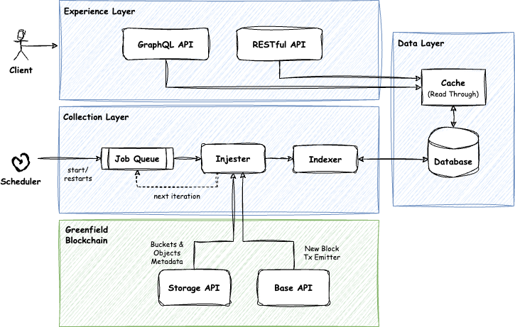

# BNB Greenfield Indexer

BNB Greenfield Indexer is an open-source indexing service and API designed to efficiently organise metadata of objects and buckets on BNB Greenfield.
It provides real-time indexing to an off-chain database, allowing easy access and searchability of metadata for storage buckets and objects through a REST and GraphQL API.

This project is a respond to the following community wishlist:
https://github.com/bnb-chain/community-contributions/bnb-greenfield-wishlist-corechain.md#challenge-greenfield-tagging-and-indexing-service

This challenge is proposed to incorporate a robust tagging indexing system, allowing for efficient data search by tags.

## Features

- **Real-time Indexing**: Automatically indexes new objects and buckets as they are added to Greenfield.
- **Tags Search**: Offers tags search capabilities, allowing search by tags keys or value or both.
- **Pagination Support**: Efficiently browse through large datasets with built-in pagination support.
- **Open Source**: Fully open-source, enabling contributions and customizations from the developer community.

## Environment Support

- BNB Greenfield Mainnet
- BNB Greenfield Testnet

## Indexed Data

In addition to buckets and objects tags, we also index the following fields as part of the tags:

- _owner
- _visibility
- _source_type
- _content_type (objects only)

## GraphQL and RESTful API Reference

The Greenfield Indexer API offers several queries and endpoints for interacting with the indexed metadata.

For a full list of available endpoints and detailed usage instructions, please refer to the API documentation at [/docs/api-documentation.md](/docs/api-documentation.md)

## Technical Design

### Tech Stack

- NextJS, NodeJS, Express, GraphQL, TypeScript, MongoDB, Vercel, Redis

### Architecture Diagram

    

**Experience Layer**

- **GraphQL API**: GraphQL API for consumers to perform search queries on buckets and objects.
- **RESTful API**: REST API for consumers to perform search queries on buckets and objects.

**Collection Layer**

- **Job Queue**: Stores the collection trigger events in which the injester will act on. (Phase 2)
- **Injester**: Retrieves bucket and objects metadata from Greenfield blockchain using the RPC URL.
- **Indexer**: Process the raw data retrieved from Greenfield blockchain and index them in the offchain database.
- **Scheduler**: Cron job responsible for starting the collection process, and restarting the process should there be a failed collection attempt.

**Data Layer**

- Cache: Read through cache for reducing load to the datababase and serving query for efficiently. (Phase 2)
- Database: MongoDB database storing the index of the buckets and objects metadata.

**Greenfield Blockchain**

- Storage API: The ListBuckets and ListObjects endpoints in Greenfield blockchain are used to fetch metadata for new buckets and objects.
- Base API: The GetBlockByHeight endpoint is used to detect updates to existing buckets and objects through transactions. (Phase 2)

### Technical Considerations

The Greenfield Indexer is designed with modern architectural principles to ensure high availability, scalability, and maintainability. Below are key technical considerations that have been taken into account:

- **Serverless Architecture**: The service is designed for deployment on cloud platforms as a serverless function. This approach eliminates the need for managing server resources, allowing the service to scale automatically in response to request volumes and reducing operational overhead.

- **Stateless Design**: The collection service is engineered to be stateless, enabling it to be invoked multiple times without risking data duplication or inconsistency. This statelessness ensures that each operation is independent, promoting scalability and reliability.

- **Resilience and Reliability**: With the implementation of scheduled triggers, the service possesses built-in resilience. These triggers not only facilitate automatic retries in case of failures but also ensure that data collection can be seamlessly resumed from the last successful synchronization point, minimizing data gaps.

- **Asynchronous Operations**: Designed for asynchronous execution, the collection service allows for a "fire and forget" model of operation. Once initiated, it proceeds with the data ingestion and indexing processes independently, allowing calling processes to continue without waiting for completion.

These considerations underscore our commitment to leveraging contemporary cloud-native technologies and practices to deliver a robust, efficient, and user-friendly service.

## Getting Started

### Prerequisites

- Node.js (v14 or later recommended)
- MongoDB for storing the indexed data

### Setup Collector

Refer to documentation at [/packages/collector/README.md](/packages/collector/README.md)

### Setup API

Refer to documentation at [/packages/api/README.md](/packages/api/README.md)

## Contributing

We welcome contributions to the Greenfield Indexer! If you have suggestions for improvements or encounter any issues, please feel free to submit an issue or pull request on GitHub.

## License

Greenfield Indexer is open-source software licensed under the MIT license.
